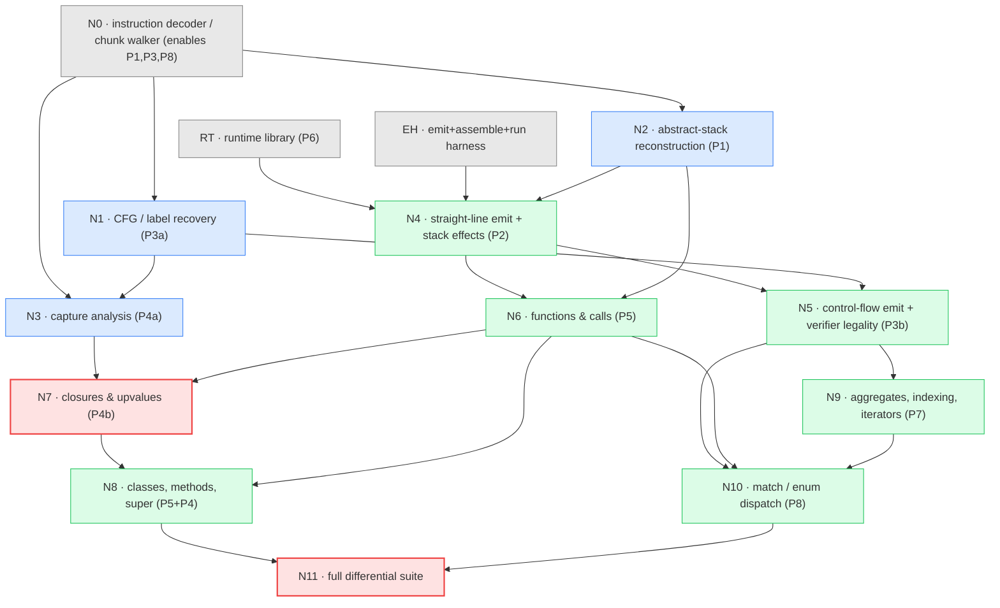

# Backend implementation DAG

**Historical.** This was the build plan for the JVM backend, which is
complete and merged. It is kept as the reference for the still-pending CLR
half of the plan, and as a record of the completed JVM half — not as a
current design document.

A dependency graph for building the JVM/CLR backends, derived from the problem
analysis in `bytecode-translation-problems.md` and the literature verdicts in
`translation-probes/README.md`. Each node is a **problem+solution pair** with a
**verifiable checkpoint** — a concrete, runnable gate that must pass before its
dependents start. Nodes are ordered so that every checkpoint is executable using
only its ancestors.

Assumes the toolchain is solved (JDK+jasmin / .NET SDK+ilasm in the image).

## Structure: what is shared vs forked per target

- **Analysis nodes (N0–N3) are target-independent.** They run over the loxpp
  `ObjFunction` tree and produce facts (CFG, abstract stack, capture map) with no
  JVM/CLR knowledge. Write once; both backends consume them.
- **Emission nodes (N4–N10) fork per target** (JVM Jasmin `.j` vs CLR CIL `.il`).
  The node structure and checkpoints are *identical* across targets — only the
  instruction templates and the runtime-library language differ. Build one target
  to green, then the second reuses every analysis node and every checkpoint.
- **The gate (N11) is differential** across native loxpp ⟷ JVM ⟷ CLR.

## Resolved design decisions

All settled to stay faithful to the Lox++ spec and the current C++ implementation.

**RT contract**

- **Premise → chunk-walker.** Reuse the existing bytecode; do not add an AST/IR
  codegen path. (This is why N0–N3, the un-fusing analyses, exist.)
- **Globals → A2 (global map).** `LoxGlobals` holds a name→value map
  (`HashMap`/`Dictionary`); `DEFINE/GET/SET_GLOBAL` call `define`/`get`/`set`, and
  `get`/`set`-undefined throw. Faithful to the spec's dynamic, late-bound globals;
  keeps global-access cost comparable to the native VM's hash lookup for the perf
  baseline. (Static fields rejected: single-file only, not spec-faithful.)
- **Enum → B1 (tagged struct).** `LoxEnum` = int tag + optional payload array,
  matching the current C++ `ObjEnum`. Revisit only if enum variants gain methods
  (on the roadmap).
- **Numbers → emulate C `%g`.** Number `stringify` reproduces native's
  `snprintf("%g")` exactly (6 significant digits, trailing zeros stripped, `e±0N`
  exponents) — *not* `Double.toString`/`double.ToString()`, which diverge
  (`3.0`→`"3"`, `0.1+0.2`→`"0.3"`, `1e6`→`"1e+06"`). Native is the reference oracle.
- **Strings → native `String`.** Lox++ strings are ASCII per spec
  (`03-types.md`), so `java.lang.String`/`System.String` are faithful: byte index =
  char index, `len` = char count, `for-in` = per-char. The runtime assumes ASCII;
  non-ASCII bytes (e.g. from file I/O) are outside the string contract (undefined
  per spec).
- **Stdlib → full native surface.** The runtimes reimplement the whole native
  stdlib: `globals` (clock, …), `math_module`, `map_api` (keys/values/entries/
  has/del), and `file_api` (file I/O). This bounds what the N11 corpus can run and
  makes RT a heavier node than a benchmark-minimal port.

**Verification & build order**

- **Map order → unspecified; canonicalize at the program level (Option 1).** The
  spec leaves map iteration order unspecified, so native/JVM/CLR may legitimately
  differ. N11 does *not* sort output; instead map tests are written to emit a fixed
  order (sort keys in the Lox++ program). Keeps the spec free and needs no
  order-sensitivity logic in the runner. (Pinning an order / excluding tests were
  the rejected alternatives.)
- **Differential scope → stdout only.** N11 compares stdout of successful
  programs. Error messages, stderr, and exit codes are *not* compared (Phase 1), so
  no line-number debug info (`LineNumberTable`/CIL `.line`) is required in
  N0/emission.
- **Target order → JVM first.** Take JVM to green (jasmin auto-computes stack-map
  frames and `.maxstack`), then CLR reuses N0–N3 unchanged (CLR must hand-compute
  `.maxstack`).

## Build & emission notes (from the toolchain image, PR #94)

The `dev-managed` image (OpenJDK 21 + jasmin 2.4 + .NET SDK 8 + ilasm 8.0) proves
the assemble→run path in CI. Facts it pins down for the nodes:

- **Runtime-library build.** Build `lox-rt.jar` with plain `javac` + `jar` — the
  image has **no** maven/gradle; build `LoxRuntime.dll` with `dotnet build` (a
  dependency-free `net8.0` class library, so restore works offline). The JVM
  plan now specifies `javac`+`jar` for this (its `mvn`/`gradle` mention was
  corrected). This library-build path is *not* covered by the smoke test —
  RT's own unit-test checkpoint is where `jar`/`dotnet build` are first exercised.
- **EH harness — reuse, don't reinvent.** EH *is* PR #94's
  `tools/toolchain_smoke/{Hello.java,hello.j,hello.il}` + `check_managed_toolchains.sh`.
  Point the EH node at it. `hello.il` also carries a minimal working
  `.assembly extern` set for CoreCLR.
- **CLR module scaffolding** — required by the CLR emission nodes (N4/N5),
  discovered in #94:
  - Assemble with `-exe -output:X.dll` — Linux ilasm reads options with `-`, not
    `/` (a leading `/exe` is parsed as an absolute path and fails).
  - Generate `X.runtimeconfig.json` per module; ilasm emits none and `dotnet`
    refuses to run an assembly without it.
  - Emit a `.assembly extern` per BCL assembly referenced (`System.Runtime`,
    `System.Console`, …) plus `LoxRuntime` — CoreCLR has no single `mscorlib`
    umbrella, so the extern set grows as features touch more of the BCL.

## The graph

Red = correctness gates (N7 is the test-evading-bug gate; N11 is the final
parity gate). Blue = target-independent analysis. Green = per-target emission.

## Linearized build order

A strict topological ordering of the DAG: executing exactly one node at a time
in this sequence never starts a node before its dependencies are green. (The DAG
above shows where you may instead parallelize — RT/EH/N0 can all proceed at once,
and steps 4–6 are independent analyses.)

1. **RT** — runtime library. ✔ runtime unit tests pass with *no codegen* (`add`, `in`, `slice`, enum-identity); `lox-rt.jar`/`LoxRuntime.dll` builds.
2. **EH** — emit+assemble+run harness. ✔ a hand-written `Hello.j`/`.il` calls `LoxOps.print`, assembles, runs, links RT.
3. **N0** — decoder / chunk walker. ✔ re-disassembly byte-matches `loxpp -DLOXPP_DEBUG_PRINT_CODE` on every probe.
4. **N1** — CFG / label recovery. ✔ `05_for` shows 2 back-edges + 1 forward skip; all targets are leaders.
5. **N2** — abstract-stack reconstruction. ✔ `01` POPs classify TEMP vs LOCAL-RECLAIM; `15` `.maxstack` matches.
6. **N3** — capture analysis. ✔ `06`/`V1`/`V3` capture maps + `CLOSE_UPVALUE` live-ranges are as expected.
7. **N4** — straight-line emit + stack effects. ✔ `01`,`15` stdout == native.
8. **N5** — control-flow emit + verifier. ✔ `02`–`05` == native **and** verifier accepts.
9. **N6** — functions & calls. ✔ `08` prints `3`; script returns from void `main`.
10. **N7** — closures & upvalues **[BUG GATE]**. ✔ `V1`→`0/1/2` (not `2/2/2`), `V2`→`2`, `V3`→`3/3/3`.
11. **N8** — classes, methods, super. ✔ `09`→`5`, `10`→`2`.
12. **N9** — aggregates, indexing, iterators. ✔ `11`→`1/2/3`, `12`→`10`, `16`→`el/true`.
13. **N10** — match / enum dispatch. ✔ `14`→`5`; dense match dispatches + `MATCH_ERROR` on out-of-range.
14. **N11** — full differential suite **[PARITY GATE]**. ✔ all probes + repo corpus byte-identical across native ⟷ JVM ⟷ CLR.

> Steps 7–13 (emission) are per-target: take them to green for one target (say
> JVM), then repeat 7–13 for CLR reusing steps 1–6 unchanged.

## Nodes and checkpoints

| Node | Discharges | Deliverable | Depends on | Verifiable checkpoint |
|---|---|---|---|---|
| **RT** | P6 | Runtime lib: `LoxOps` (incl. `stringify` emulating C `%g`), `LoxCallable`/`LoxClosure`, `LoxClass`/`LoxInstance`, `LoxList`/`LoxMap`/`LoxIterator`/`LoxEnum` (tagged struct, B1), `LoxGlobals` (name→value map, A2), `LoxError`; native `String` (ASCII); **full stdlib** (`math_module`, `map_api`, `file_api`, `globals`); boxing + one `Callable` interface | — | Runtime unit tests green in Java/C# with **no codegen**: `add(1.0,2.0)==3.0`, `stringify(3.0)=="3"` and `stringify(1e6)=="1e+06"`, `in(1,[1,2,3])==true`, `slice("hello",1,3)=="el"`, `Enum` equality is identity, `LoxGlobals.get(undefined)` throws. Builds `lox-rt.jar` (`javac`+`jar`) / `LoxRuntime.dll` (`dotnet build`) — no maven/gradle. |
| **EH** | (infra) | Emit `.j`/`.il` text; assemble via jasmin/ilasm; load+run. **Reuse PR #94's `tools/toolchain_smoke/` + `check_managed_toolchains.sh`** (see Build & emission notes for the CLR module scaffolding) | toolchain (`dev-managed`) | `check_managed_toolchains.sh` green: hand-written `Hello.java`/`hello.j`/`hello.il` assemble, run, and (once RT exists) link against it — assemble→run→link end-to-end. |
| **N0** | enables P1/P3/P8 | Decoder for every op incl. variable-length `CLOSURE`, `JUMP_TABLE`, `INVOKE`; walks the `ObjFunction` tree | — | Re-disassemble each probe from the walker; **byte/structure-exact diff** against `loxpp -DLOXPP_DEBUG_PRINT_CODE`. No unknown/misaligned opcodes on any probe. |
| **N1** | P3a | CFG via leaders algorithm; label at every jump target | N0 | `05_for` CFG has exactly **2 back-edges + 1 forward skip**; every jump/loop/table target is a block leader; **no target lands mid-instruction** (assert). |
| **N2** | P1 | Symbolic stack sim: per-offset height, slot classification (named-local vs temporary), max-stack | N0 | `01_assign_local`: offset 8 `POP` → **TEMP**, offset 12 `POP` → **LOCAL-RECLAIM**. `15_nested_arith`: computed `.maxstack` equals independent count. Stack height == 0 at every `RETURN`. |
| **N3** | P4a | Capture map: which slots are captured (→ ref-cell) + `CLOSE_UPVALUE` live-range ends. A `CLOSE_UPVALUE`'s target slot is computed directly, not inferred: this node walks the CFG (N1) once to get the exact frame stack height before every instruction (fixed per-opcode effects, entry height = 1+arity, throw on any merge disagreement — mirrors `vm.cpp closeUpvalues(stackTop - 1)`), then `closeSlot(offset) = height(offset) - 1` names every close unambiguously (referee amendment 3 on PR #101, superseding amendments 1 and 2's static overlay, which could not represent a slot closed by more than one exit path — R22). A second CFG dataflow (unchanged from amendment 2) tracks which *instance* of a slot is open at each point, with union-find merging two branches that capture the same live incarnation into one cell. | N0, N1 | `06_shared_upvalue`: slot 1 captured by **both** get&set → 1 shared cell. `V1`: `snapshot` live-range = **loop body** (fresh/iter). `V3`: `i` live-range = **whole loop** (shared). A captured local inside an `if` inside a loop still gets its per-iteration verdict, two different variables that reuse one slot across two unrelated blocks never share a cell, and a captured slot with a close on every one of `break`/`continue`/fall-through (R22) attributes every close to the one instance. |
| **N4** | P2 | Emit CONSTANT/arith/PRINT/POP/GET_LOCAL/SET_LOCAL with `dup`/`dup_x1`; insert the invisible-`var` stores; drop reclaim-POPs | RT, EH, N2 | `01_assign_local` and `15_nested_arith` produce **stdout identical to native loxpp** (`2` / `5.4`). |
| **N5** | P3b | Emit JUMP / `JUMP_IF_FALSE`(→`dup;isFalsy;ifXX`) / LOOP to labels; all values boxed to `Object` at merges | N4, N1 | `02/03/04/05` match native output **and** the class passes the verifier (`java -Xverify:all` / ILVerify). Merge-depth consistency holds. |
| **N6** | P5 | `CLOSURE` (0 upvalues), `CALL`→`Object[]`, arg-prologue (slot0=callee/receiver, args→locals), `RETURN` dual-role (fn `areturn` / script void) | N4, ABS | `08_call` prints `3`; a script-level program returns cleanly from `void main`. |
| **N7** | P4b | Ref-cell allocation is idempotent. A runtime `instanceof [Ljava/lang/Object;` test guards it. The test runs at every CLOSURE, GET_LOCAL, and SET_LOCAL of a captured slot. This is not a static declaration-point seed. (An earlier version of this row said "at declaration point"; that text is stale. N3 opens a captured local's live range at the capturing CLOSURE. A `for` loop's condition or increment clause can revisit the slot through the LOOP back-edge, on a later trip, before the slot's own re-declaration runs. So program order alone cannot fix raw-vs-cell at codegen time. `V3_loopvar` is the standing counter-example.) GET_UPVALUE and SET_UPVALUE read and write through `cell[0]`. `CLOSE_UPVALUE` is compile-time bookkeeping only; it emits no JVM bytecode. The next declaration's own plain store is what returns a slot to raw. A local `fun` that captures itself (direct recursion) needs its own store order: seed the cell before the closure exists, then store the built closure into `cell[0]` instead of the slot (PR #111 R1; `V5`/`V6`). `CLOSURE` wiring copies each `isLocal`/upvalue entry from N3's decoded operands. **This node also lowers `BUILD_LIST`, `GET_INDEX`, and `SET_INDEX`, pulled forward from N9** (see the N9 row below). `V1` and `V3` each build a list of the closures under test and read it back by index, so this node's own checkpoint needs list and index support to run at all. `GET_INDEX`/`SET_INDEX` need no shuffle: LoxOps's parameter order already matches `vm.cpp`'s operand order. `BUILD_LIST` reuses CALL's own spill-to-scratch shape. | N6, N3 | **The bug gate.** `V1`→`0\n1\n2` (must **not** be `2\n2\n2`), `V2`→`2`, `V3`→`3\n3\n3`, `V4`→`7\n9` (shared-cell mutation, observed through `get`/`set` — `06_shared_upvalue` alone proves only that the class verifies, not any value; see notes/translation-probes/README.md), `V5`→`120` (self-recursive local `fun`), `V6`→`12` (self-recursive local `fun`, fresh cell per loop trip). |
| **N8** | P5+P4 | `CLASS`/`DEFINE_METHOD`/`GET`/`SET_PROPERTY`/`INVOKE`/`INHERIT`/`GET_SUPER`/`SUPER_INVOKE`; `init` returns `this`. `CLASS` builds with `superclass=null`; `INHERIT` mutates the subclass IN PLACE (`LoxClass.inheritFrom`, non-final `superclass` field), because compiler.cpp emits `CLASS` before the superclass clause is even parsed, and the class variable is re-read a second time right after `INHERIT` (for `DEFINE_METHOD` to find it) — that second read must see the merged state through the SAME identity, not a freshly reconstructed one. `INHERIT`'s own superclass operand is always the "super" invisible var by then, never a live stack temp — load it back, do not assume it is still under the subclass. `RETURN` needed a fix too: `bytecode-translation-problems.md`'s own "RETURN can return a named local" case (33 sites in the corpus) is first reachable end to end here, because `examples/class_dispatch.lox`'s `area()`/`describe()` `return match {...};` is the first JVM-backend checkpoint to return a match expression's value. **This node also lowers `MATCH_ERROR`, pulled forward from N10** (see the N10 row below): a `match` whose arms are all class patterns compiles a real, reachable `MATCH_ERROR`, because the compiler never proves a class pattern exhaustive over its own subclasses, and this node's own checkpoint example needs it to run at all. **The `operandDepth() == 0` slot-naming rule was redesigned in PR #113's third review round**: `lastInvisibleVarSlot`, this pass's own forward walk, silently named the WRONG slot whenever one `match`'s result fed straight into a consuming opcode, on `main`, before this fix. `loadNamedLocalAtZeroDepth` (jvm_emitter.cpp) is now the one mechanism every consumer shares: away from a CFG label, `localCount - 1` (N2's reconstructed count) names the slot outright; at a label, `localCount - 1` and `lastInvisibleVarSlot` must agree, or emission throws rather than guess. See the GAP entry in `bytecode-translation-problems.md` for the residual cases this does not cover. | N6, N7 (super = upvalue) | `09_class`→`5`; `10_super`→`2`. Method receiver at slot 0; property peek/leave correct. |
| **N9** | P7 | `BUILD_MAP` spills its temps, then array-inits them. This node adds `SLICE`, `IN`, and the for-in iterator protocol. **`BUILD_LIST`, `GET_INDEX`, and `SET_INDEX` already landed in N7, for the JVM target only** (see the N7 row). N7 did not touch the CLR backend. The CLR side of this node still owns all of P7, unchanged. Do not re-implement `BUILD_LIST`, `GET_INDEX`, or `SET_INDEX` for the JVM target. Extend `computeMaxSpillWidth` (jvm_emitter.cpp) for `BUILD_MAP`'s own width instead. Do not add a second, parallel scratch-slot scheme. **`GET_ITER` is not a plain simple op** (found running `11_for_in.lox` end to end — the C++ unit tests alone did not catch it, only `java -Xverify:all` did): it carries no operand byte, and vm.cpp replaces its own operand in place (`stackTop[-1] = ...`). N2/N3 already attribute this position's invisible-var store to the iterable expression's own declaring push (e.g. `BUILD_LIST`), one instruction earlier — so by the time `GET_ITER` runs, the JVM operand stack is already empty at that position; the value lives only in its own JVM local slot. Treating `GET_ITER` as an ordinary one-`invokestatic` simple op therefore calls `LoxOps.getIter` on an empty stack, and jasmin's own net-word-count bookkeeping cannot catch this (its declared effect is a true net zero: one popped, one pushed). **CORRECTION (PR #112 review round 1): an earlier version of this row named the slot with `analysis.before[i].height - 1`, mirroring N3's `CLOSE_UPVALUE` target computation. That is wrong here.** `height` is only an upper bound at a control-flow merge (abstract_stack.h) — the same fact PR #107 R9 and PR #109 R2 already settled for `SET_LOCAL`/`SET_GLOBAL`/`JUMP_IF_FALSE`. `CLOSE_UPVALUE` may safely use the upper bound only because N3 first proves, by a full CFG walk, that every incoming edge agrees on the exact height; `emitGetIter` has no such proof and must not copy the formula. **CORRECTION 2 (PR #113 round 3 referee decision): the fix this row used to describe next — reading `lastInvisibleVarSlot` because it "stays exact regardless of merges upstream" — is also false.** Three plain, unnested `match` programs (T1/T2/T3, see the N8 row) prove `lastInvisibleVarSlot` names the wrong slot on `main` too, with no error, only silent wrong output. `emitGetIter` now shares N8's `loadNamedLocalAtZeroDepth`: `localCount - 1` off a CFG label, cross-checked against `lastInvisibleVarSlot` on one, through the same captured-slot check `GET_LOCAL`/`SET_LOCAL` use (a sibling scope can reuse this slot number for a variable some closure elsewhere in the chunk captures). **CORRECTION 3 (CLR mission, node C-N7): `BUILD_MAP` also landed in N7 for the CLR target**, for the same mechanical reason `BUILD_LIST`/`GET_INDEX`/`SET_INDEX` did — the CLR N7 checkpoint reuses probe `12_list_map_index`, which contains a map literal and cannot compile without `BUILD_MAP`. For the CLR target this node (N9) owns `SLICE`, `IN`, and the iterator protocol only; do not re-implement `BUILD_MAP`. | N5 | `11_for_in`→`1\n2\n3`; `12_list_map_index`→`10`; `16_slice_in`→`el\ntrue`. |
| **N10** | P8 | `GET_TAG`→`tableswitch`/`switch` (box/unbox fusion), `JUMP_TABLE`→cases, enum-ctor `CALL`, payload `GET_INDEX`. **`MATCH_ERROR` already landed in N8, for the JVM target only** (see the N8 row): a plain call with no operand, needing no fusion with `JUMP_TABLE` there, since a class-pattern-only `match` never emits one. This node's own `MATCH_ERROR`-as-default lowering is `GET_TAG`/`JUMP_TABLE`'s fall-through target, already satisfied once those two land — do not re-implement `MATCH_ERROR` itself for the JVM target. **A match expression that is actually consumed (assigned, printed, returned — not discarded as a bare statement) does not yet emit at all, on any match, with or without an enum tag or a sequence pattern (found in N9 — no probe file needed, a two-line repro is enough).** `Compiler::compileMatchBody` exposes its result with exactly one native `POP`, which reclaims only the synthetic "subject" local; the native VM's fused local/operand-stack model then leaves the already-stored "result" local sitting as the new top of stack for free (compiler.cpp's own comment: "Pop the subject; result_value becomes the match expression result"). The JVM backend has no such fused model — the result local lives in its own JVM slot, untouched by that `POP` — and nothing re-loads it afterward, so the very next instruction that needs a real value on the JVM operand stack throws `jvm_emitter: operand stack underflow`. Verified minimal repro: `var n = match 1 { case _ => 5 }; print n;` fails this way, identically to a sequence-pattern match (`13_enum_match.lox`'s own `var n = match c {...};` shape will hit this too, once enum `CONSTANT` values are also representable). A bare, fully-discarded match statement (no assignment) does not reach this — its result is simply never read, on either side — so this was not visible before N9 exercised match through this emitter for the first time. This node must give the result-exposing `POP` its own classification (or otherwise re-expose the result local, e.g. an explicit load right after it) before `13_enum_match`/`14_enum_payload` — both of which assign a match's result to a variable — can pass. **N10 also owns the residue PR #113's round-3 referee decision left behind** — redesigned, PR #115 round 3, researcher referee decision (two earlier versions of this sentence each enumerated a fixed list of "still underflowing" opcodes, round 1's list and round 2's; a third review round, R15, disproved the second one within one round by naming nine more legal shapes `build/loxpp` answers correctly and this pass refused). The fix is now structural: `jvm_emitter.cpp`'s `nativePops` is an exhaustive table over `Op` stating how many operand-stack cells `src/vm.cpp` pops per opcode, and `normalizeFoldedOperands`, one pre-dispatch step every instruction shares, repairs any single folded bottom operand through it — see the GAP entry in `bytecode-translation-problems.md` for the full account. Three residues remain, none silent: (i) a match result sandwiched below TWO OR MORE live sibling operands still has no correct native answer to match (`compileMatchBody`'s own slot allocation is blind to a sibling operand already on the real VM stack — a pre-existing `build/loxpp` defect, not owed a fix), and `normalizeFoldedOperands` now throws a named, loud error for it instead of a bare underflow; (ii) the theoretical case where `loadNamedLocalAtZeroDepth`'s two slot estimates agree and are both wrong needs real per-edge merge verification, which no node has attempted; (iii) **REACHABLE (R22, PR #115 round 4)** — a folded match result plus a LATER sibling operand of the same consumer that ends in `and`/`or` puts the consumer's own offset on the `and`/`or` join label, where `loadNamedLocalAtZeroDepth`'s two estimates disagree and it refuses; `build/loxpp` answers all four known repros correctly (see the GAP entry). All three need only the same per-edge merge verification (ii) already names; none blocks a required gate. **A REACHABLE gap outside this node's own file** (originally R13, PR #115 round 2; disposition ruled by the round-3 referee): `and`/`or` over a folded `match` operand fails at analysis time in N2's own `abstract_stack.cpp` (a merge-disagreement throw, not a silent wrong answer), on a program `build/loxpp` runs correctly. Fixing it means changing N2's own fold/merge model, which this node's charter does not cover; the referee ruled it **not assigned to any node** — N11 does not own it, and a program that ever reaches it is itself a researcher-unblock condition. See the GAP entry for the full account. | N5, N6, N9 | `14_enum_payload`→`5`; a fixed dense `match` over enum variants dispatches to the correct arm and traps out-of-range via `MATCH_ERROR`. |
| **N11** | (gate) | Differential test runner, native ⟷ JVM (**stdout only**; CLR is out of scope for this mission, `brief.md` section 1) | all | **Delivered in PR #116.** `tools/diff_runtimes.py` runs every probe and, on request, any example set, and compares stdout only (stderr and exit codes are not compared). Every probe in `notes/translation-probes/` is byte-identical on native and JVM. The repo example corpus is byte-identical **except** four permutation exclusions. On a DIVERGE, the runner names the likely opcode family from a comment-and-string-stripped syntax scan; this localizes, but is a heuristic, not a bytecode decode. **`tools/jvm_excluded_examples.txt` holds four entries.** N8 (PR #113 round 4) proved `examples/word_freq.lox`, `examples/anagram_groups.lox`, and `examples/symbol_table.lox` are permutations (JVM's `LinkedHashMap` insertion order vs. native's bucket order). N11 (PR #116) added the fourth, `examples/phonebook.lox` (its `for (var name in book)` at line 21 iterates a `Map`), and wired `tools/diff_runtimes.py --only-excluded` into CI so every entry's permutation proof re-runs on every PR; an entry that stops being a permutation reports DIVERGE and fails the gate. CI runs the full corpus through `diff_runtimes.py` directly, so an example with no `CHECK` directive (`bench_jump_table.lox`, `remove.lox`) cannot pass with a wrong JVM answer. |

## Critical path & parallelization

- **Longest correctness chain:** `N0 → N2 → N4 → N5 → N9 → N10 → N11`.
- **Closure chain (parallel to the above until N7):** `N0 → N1 → N3` and
  `N4 → N6 → N7 → N8`.
- **Immediately parallel once N0 lands:** N1 and N2. N3 needs N1's CFG (a
  linear, order-only walk cannot soundly resolve which slot an operand-less
  `CLOSE_UPVALUE` closes across alternate exits — see PR #101's round-3
  referee decision), so it starts once N1 is green, not immediately with N0.
- **N3 computes its own per-offset frame stack heights over N0+N1** (raw
  height only, no locals/temporaries split — referee amendment 3, PR #101).
  N2 computes a related but strictly richer number (height split into
  locals vs. temporaries, for the JVM local-variable array). A later node
  may fold N3's height walk into N2's abstract stack so both read one
  shared number; until then the two stay independent, matching how N2
  already keeps its own private CFG builder alongside N1's. N2.md's hazards
  section once assigned that unification to N5; N5 (PR #109) did not do it
  and does not list it as a deliverable, so it stays unassigned — pick a
  named owner before doing it, rather than repeating the stale claim.
- **RT and EH have no analysis dependencies** — build them first (or in parallel
  with N0). RT can even be test-driven to green before any codegen exists.
- **N7 is the highest-value gate to reach early.** It is the only node whose
  naive implementation passes an obvious test (`V3`) while silently failing the
  real one (`V1`). Prioritize getting to N7 and its `V1` checkpoint before
  investing in N8–N10, so the closure model is proven before more code depends
  on it.

## Suggested milestones

1. **M1 — "hello, verified":** RT + EH + N0. A hand-written class runs; the
   decoder round-trips every probe. No translation yet, but the rails exist.
2. **M2 — "straight-line + control flow":** N1, N2, N4, N5. Probes 01–05, 15
   match native and verify. This proves the un-fusing (P1/P2/P3) — the part with
   no off-the-shelf tool.
3. **M3 — "functions + closures":** N3, N6, N7. Reaches the `V1` gate; the
   closure semantics are proven correct against the plans' known bug.
4. **M4 — "OOP + data + match":** N8, N9, N10. Full language surface.
5. **M5 — "parity":** N11 green on both targets against the whole corpus.
