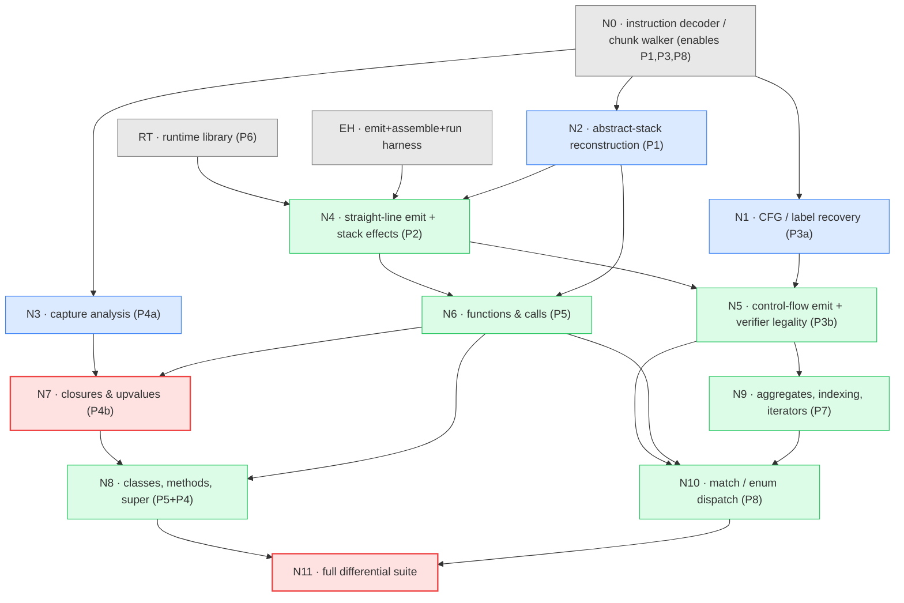

# Backend implementation DAG

A dependency graph for building the JVM/CLR backends, derived from the problem
analysis in `bytecode-translation-problems.md` and the literature verdicts in
`translation-probes/README.md`. Each node is a **problem+solution pair** with a
**verifiable checkpoint** — a concrete, runnable gate that must pass before its
dependents start. Nodes are ordered so that every checkpoint is executable using
only its ancestors.

Assumes the toolchain is solved (JDK+jasmin / .NET SDK+ilasm in the image).

## Structure: what is shared vs forked per target

- **Analysis nodes (N0–N3) are target-independent.** They run over the loxpp
  `ObjFunction` tree and produce facts (CFG, abstract stack, capture map) with no
  JVM/CLR knowledge. Write once; both backends consume them.
- **Emission nodes (N4–N10) fork per target** (JVM Jasmin `.j` vs CLR CIL `.il`).
  The node structure and checkpoints are *identical* across targets — only the
  instruction templates and the runtime-library language differ. Build one target
  to green, then the second reuses every analysis node and every checkpoint.
- **The gate (N11) is differential** across native loxpp ⟷ JVM ⟷ CLR.

## Resolved design decisions

All settled to stay faithful to the Lox++ spec and the current C++ implementation.

**RT contract**

- **Premise → chunk-walker.** Reuse the existing bytecode; do not add an AST/IR
  codegen path. (This is why N0–N3, the un-fusing analyses, exist.)
- **Globals → A2 (global map).** `LoxGlobals` holds a name→value map
  (`HashMap`/`Dictionary`); `DEFINE/GET/SET_GLOBAL` call `define`/`get`/`set`, and
  `get`/`set`-undefined throw. Faithful to the spec's dynamic, late-bound globals;
  keeps global-access cost comparable to the native VM's hash lookup for the perf
  baseline. (Static fields rejected: single-file only, not spec-faithful.)
- **Enum → B1 (tagged struct).** `LoxEnum` = int tag + optional payload array,
  matching the current C++ `ObjEnum`. Revisit only if enum variants gain methods
  (on the roadmap).
- **Numbers → emulate C `%g`.** Number `stringify` reproduces native's
  `snprintf("%g")` exactly (6 significant digits, trailing zeros stripped, `e±0N`
  exponents) — *not* `Double.toString`/`double.ToString()`, which diverge
  (`3.0`→`"3"`, `0.1+0.2`→`"0.3"`, `1e6`→`"1e+06"`). Native is the reference oracle.
- **Strings → native `String`.** Lox++ strings are ASCII per spec
  (`03-types.md`), so `java.lang.String`/`System.String` are faithful: byte index =
  char index, `len` = char count, `for-in` = per-char. The runtime assumes ASCII;
  non-ASCII bytes (e.g. from file I/O) are outside the string contract (undefined
  per spec).
- **Stdlib → full native surface.** The runtimes reimplement the whole native
  stdlib: `globals` (clock, …), `math_module`, `map_api` (keys/values/entries/
  has/del), and `file_api` (file I/O). This bounds what the N11 corpus can run and
  makes RT a heavier node than a benchmark-minimal port.

**Verification & build order**

- **Map order → unspecified; canonicalize at the program level (Option 1).** The
  spec leaves map iteration order unspecified, so native/JVM/CLR may legitimately
  differ. N11 does *not* sort output; instead map tests are written to emit a fixed
  order (sort keys in the Lox++ program). Keeps the spec free and needs no
  order-sensitivity logic in the runner. (Pinning an order / excluding tests were
  the rejected alternatives.)
- **Differential scope → stdout only.** N11 compares stdout of successful
  programs. Error messages, stderr, and exit codes are *not* compared (Phase 1), so
  no line-number debug info (`LineNumberTable`/CIL `.line`) is required in
  N0/emission.
- **Target order → JVM first.** Take JVM to green (jasmin auto-computes stack-map
  frames and `.maxstack`), then CLR reuses N0–N3 unchanged (CLR must hand-compute
  `.maxstack`).

## Build & emission notes (from the toolchain image, PR #94)

The `dev-managed` image (OpenJDK 21 + jasmin 2.4 + .NET SDK 8 + ilasm 8.0) proves
the assemble→run path in CI. Facts it pins down for the nodes:

- **Runtime-library build.** Build `lox-rt.jar` with plain `javac` + `jar` — the
  image has **no** maven/gradle; build `LoxRuntime.dll` with `dotnet build` (a
  dependency-free `net8.0` class library, so restore works offline). The JVM
  plan's `pom.xml`/`mvn`/`gradle` mention is superseded and gets corrected at the
  post-#94 rebase. This library-build path is *not* covered by the smoke test —
  RT's own unit-test checkpoint is where `jar`/`dotnet build` are first exercised.
- **EH harness — reuse, don't reinvent.** EH *is* PR #94's
  `tools/toolchain_smoke/{Hello.java,hello.j,hello.il}` + `check_managed_toolchains.sh`.
  Point the EH node at it. `hello.il` also carries a minimal working
  `.assembly extern` set for CoreCLR.
- **CLR module scaffolding** — required by the CLR emission nodes (N4/N5),
  discovered in #94:
  - Assemble with `-exe -output:X.dll` — Linux ilasm reads options with `-`, not
    `/` (a leading `/exe` is parsed as an absolute path and fails).
  - Generate `X.runtimeconfig.json` per module; ilasm emits none and `dotnet`
    refuses to run an assembly without it.
  - Emit a `.assembly extern` per BCL assembly referenced (`System.Runtime`,
    `System.Console`, …) plus `LoxRuntime` — CoreCLR has no single `mscorlib`
    umbrella, so the extern set grows as features touch more of the BCL.

## The graph

Red = correctness gates (N7 is the test-evading-bug gate; N11 is the final
parity gate). Blue = target-independent analysis. Green = per-target emission.

## Linearized build order

A strict topological ordering of the DAG: executing exactly one node at a time
in this sequence never starts a node before its dependencies are green. (The DAG
above shows where you may instead parallelize — RT/EH/N0 can all proceed at once,
and steps 4–6 are independent analyses.)

1. **RT** — runtime library. ✔ runtime unit tests pass with *no codegen* (`add`, `in`, `slice`, enum-identity); `lox-rt.jar`/`LoxRuntime.dll` builds.
2. **EH** — emit+assemble+run harness. ✔ a hand-written `Hello.j`/`.il` calls `LoxOps.print`, assembles, runs, links RT.
3. **N0** — decoder / chunk walker. ✔ re-disassembly byte-matches `loxpp -DLOXPP_DEBUG_PRINT_CODE` on every probe.
4. **N1** — CFG / label recovery. ✔ `05_for` shows 2 back-edges + 1 forward skip; all targets are leaders.
5. **N2** — abstract-stack reconstruction. ✔ `01` POPs classify TEMP vs LOCAL-RECLAIM; `15` `.maxstack` matches.
6. **N3** — capture analysis. ✔ `06`/`V1`/`V3` capture maps + `CLOSE_UPVALUE` live-ranges are as expected.
7. **N4** — straight-line emit + stack effects. ✔ `01`,`15` stdout == native.
8. **N5** — control-flow emit + verifier. ✔ `02`–`05` == native **and** verifier accepts.
9. **N6** — functions & calls. ✔ `08` prints `3`; script returns from void `main`.
10. **N7** — closures & upvalues **[BUG GATE]**. ✔ `V1`→`0/1/2` (not `2/2/2`), `V2`→`2`, `V3`→`3/3/3`.
11. **N8** — classes, methods, super. ✔ `09`→`5`, `10`→`2`.
12. **N9** — aggregates, indexing, iterators. ✔ `11`→`1/2/3`, `12`→`10`, `16`→`el/true`.
13. **N10** — match / enum dispatch. ✔ `14`→`5`; dense match dispatches + `MATCH_ERROR` on out-of-range.
14. **N11** — full differential suite **[PARITY GATE]**. ✔ all probes + repo corpus byte-identical across native ⟷ JVM ⟷ CLR.

> Steps 7–13 (emission) are per-target: take them to green for one target (say
> JVM), then repeat 7–13 for CLR reusing steps 1–6 unchanged.

## Nodes and checkpoints

| Node | Discharges | Deliverable | Depends on | Verifiable checkpoint |
|---|---|---|---|---|
| **RT** | P6 | Runtime lib: `LoxOps` (incl. `stringify` emulating C `%g`), `LoxCallable`/`LoxClosure`, `LoxClass`/`LoxInstance`, `LoxList`/`LoxMap`/`LoxIterator`/`LoxEnum` (tagged struct, B1), `LoxGlobals` (name→value map, A2), `LoxError`; native `String` (ASCII); **full stdlib** (`math_module`, `map_api`, `file_api`, `globals`); boxing + one `Callable` interface | — | Runtime unit tests green in Java/C# with **no codegen**: `add(1.0,2.0)==3.0`, `stringify(3.0)=="3"` and `stringify(1e6)=="1e+06"`, `in(1,[1,2,3])==true`, `slice("hello",1,3)=="el"`, `Enum` equality is identity, `LoxGlobals.get(undefined)` throws. Builds `lox-rt.jar` (`javac`+`jar`) / `LoxRuntime.dll` (`dotnet build`) — no maven/gradle. |
| **EH** | (infra) | Emit `.j`/`.il` text; assemble via jasmin/ilasm; load+run. **Reuse PR #94's `tools/toolchain_smoke/` + `check_managed_toolchains.sh`** (see Build & emission notes for the CLR module scaffolding) | toolchain (`dev-managed`) | `check_managed_toolchains.sh` green: hand-written `Hello.java`/`hello.j`/`hello.il` assemble, run, and (once RT exists) link against it — assemble→run→link end-to-end. |
| **N0** | enables P1/P3/P8 | Decoder for every op incl. variable-length `CLOSURE`, `JUMP_TABLE`, `INVOKE`; walks the `ObjFunction` tree | — | Re-disassemble each probe from the walker; **byte/structure-exact diff** against `loxpp -DLOXPP_DEBUG_PRINT_CODE`. No unknown/misaligned opcodes on any probe. |
| **N1** | P3a | CFG via leaders algorithm; label at every jump target | N0 | `05_for` CFG has exactly **2 back-edges + 1 forward skip**; every jump/loop/table target is a block leader; **no target lands mid-instruction** (assert). |
| **N2** | P1 | Symbolic stack sim: per-offset height, slot classification (named-local vs temporary), max-stack | N0 | `01_assign_local`: offset 8 `POP` → **TEMP**, offset 12 `POP` → **LOCAL-RECLAIM**. `15_nested_arith`: computed `.maxstack` equals independent count. Stack height == 0 at every `RETURN`. |
| **N3** | P4a | Capture map: which slots are captured (→ ref-cell) + `CLOSE_UPVALUE` live-range ends | N0 | `06_shared_upvalue`: slot 1 captured by **both** get&set → 1 shared cell. `V1`: `snapshot` live-range = **loop body** (fresh/iter). `V3`: `i` live-range = **whole loop** (shared). |
| **N4** | P2 | Emit CONSTANT/arith/PRINT/POP/GET_LOCAL/SET_LOCAL with `dup`/`dup_x1`; insert the invisible-`var` stores; drop reclaim-POPs | RT, EH, N2 | `01_assign_local` and `15_nested_arith` produce **stdout identical to native loxpp** (`2` / `5.4`). |
| **N5** | P3b | Emit JUMP / `JUMP_IF_FALSE`(→`dup;isFalsy;ifXX`) / LOOP to labels; all values boxed to `Object` at merges | N4, N1 | `02/03/04/05` match native output **and** the class passes the verifier (`java -Xverify:all` / ILVerify). Merge-depth consistency holds. |
| **N6** | P5 | `CLOSURE` (0 upvalues), `CALL`→`Object[]`, arg-prologue (slot0=callee/receiver, args→locals), `RETURN` dual-role (fn `areturn` / script void) | N4, ABS | `08_call` prints `3`; a script-level program returns cleanly from `void main`. |
| **N7** | P4b | Ref-cell alloc **at declaration point** (fresh per loop iter), GET/SET_UPVALUE via `cell[0]`, `CLOSE_UPVALUE` ends live-range; `CLOSURE` upvalue wiring (isLocal/upvalue) | N6, N3 | **The bug gate.** `V1`→`0\n1\n2` (must **not** be `2\n2\n2`), `V2`→`2`, `V3`→`3\n3\n3`, `06`-style get/set observes shared mutation. |
| **N8** | P5+P4 | `CLASS`/`DEFINE_METHOD`/`GET`/`SET_PROPERTY`/`INVOKE`/`INHERIT`/`GET_SUPER`/`SUPER_INVOKE`; `init` returns `this` | N6, N7 (super = upvalue) | `09_class`→`5`; `10_super`→`2`. Method receiver at slot 0; property peek/leave correct. |
| **N9** | P7 | `BUILD_LIST`/`BUILD_MAP` (spill temps → array-init), `GET`/`SET_INDEX`, `SLICE`, `IN`, for-in iterator protocol | N5 | `11_for_in`→`1\n2\n3`; `12_list_map_index`→`10`; `16_slice_in`→`el\ntrue`. |
| **N10** | P8 | `GET_TAG`→`tableswitch`/`switch` (box/unbox fusion), `JUMP_TABLE`→cases, `MATCH_ERROR`=default, enum-ctor `CALL`, payload `GET_INDEX` | N5, N6, N9 | `14_enum_payload`→`5`; a fixed dense `match` over enum variants dispatches to the correct arm and traps out-of-range via `MATCH_ERROR`. |
| **N11** | (gate) | Differential test runner across all three runtimes (**stdout only**; map tests emit a fixed key order) | all | Every probe **and** the repo test corpus produce **byte-identical stdout** on native ⟷ JVM ⟷ CLR (stderr/exit codes not compared). Any divergence localizes to one opcode family. |

## Critical path & parallelization

- **Longest correctness chain:** `N0 → N2 → N4 → N5 → N9 → N10 → N11`.
- **Closure chain (parallel to the above until N7):** `N0 → N3` and
  `N4 → N6 → N7 → N8`.
- **Immediately parallel once N0 lands:** N1, N2, N3 (independent analyses).
- **RT and EH have no analysis dependencies** — build them first (or in parallel
  with N0). RT can even be test-driven to green before any codegen exists.
- **N7 is the highest-value gate to reach early.** It is the only node whose
  naive implementation passes an obvious test (`V3`) while silently failing the
  real one (`V1`). Prioritize getting to N7 and its `V1` checkpoint before
  investing in N8–N10, so the closure model is proven before more code depends
  on it.

## Suggested milestones

1. **M1 — "hello, verified":** RT + EH + N0. A hand-written class runs; the
   decoder round-trips every probe. No translation yet, but the rails exist.
2. **M2 — "straight-line + control flow":** N1, N2, N4, N5. Probes 01–05, 15
   match native and verify. This proves the un-fusing (P1/P2/P3) — the part with
   no off-the-shelf tool.
3. **M3 — "functions + closures":** N3, N6, N7. Reaches the `V1` gate; the
   closure semantics are proven correct against the plans' known bug.
4. **M4 — "OOP + data + match":** N8, N9, N10. Full language surface.
5. **M5 — "parity":** N11 green on both targets against the whole corpus.
